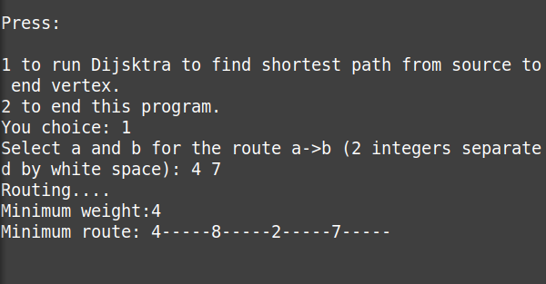
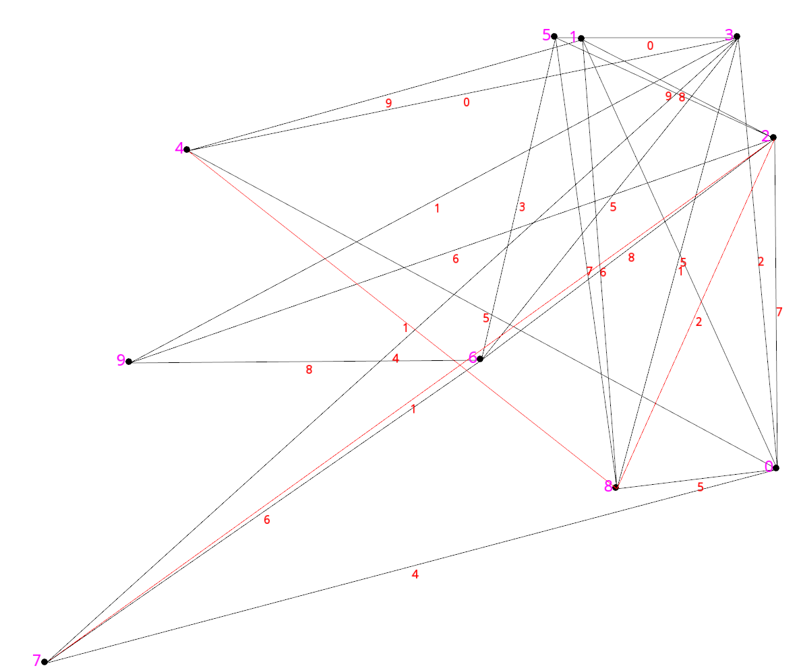

# Dijkstra-s-Algorithm - Build.For.Fun

This app will help to visualize Dijsktra's algorithm.

# How to use

* The main.cpp will generate a graph including vertices and weighted edges. Then you will be asked to input 2 vertices that needs to find the shortest path.
* `cor.txt` will control the coordination of vertices on the graph.
* `edge.txt` will control the weighted edges.


## Execution:
1. Install SFML:

```sudo apt-get install libsfml-dev```

2. Compile all .cpp file together:

```g++ -c main.cpp -o main.o```

3. Link all the compiled files with the used library ( this project uses 3 libraries ):

```g++ main.o Graph.o -o sfml-app -lsfml-graphics -lsfml-window -lsfml-system```

5. The executable file:

```./sfml-app```

## Or you can just install the library and run this:

```g++ -c main.cpp -o main.o; g++ -c Graph.cpp -o Graph.o; g++ main.o Graph.o -o sfml.app -lsfml-graphics -lsfml-window -lsfml-system;```

# Extra:

* To change the graph randomly, run:
```python3 random_gen.py```

* Then run the app again to see the new graph:
```./sfml-app```

## Note:
* You might need to run it multiple times if the script does not give you a good randomized set for visualization purpose.
* cor_edge_sameple.txt is a test set if needed.

## Demo:



